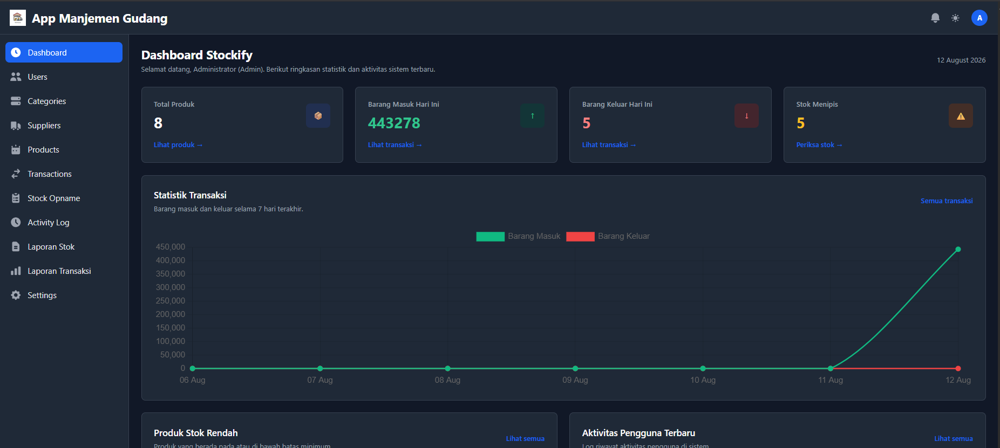
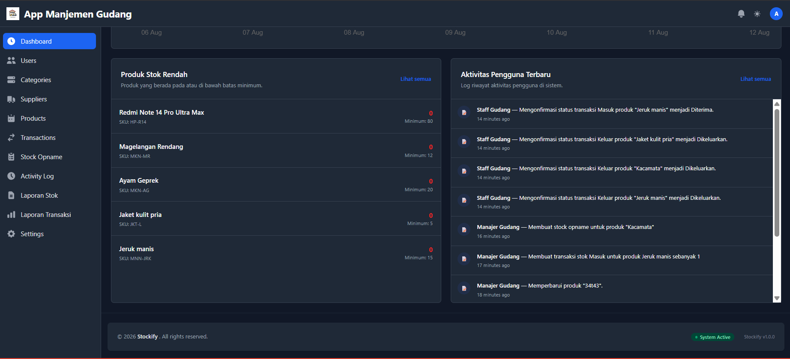
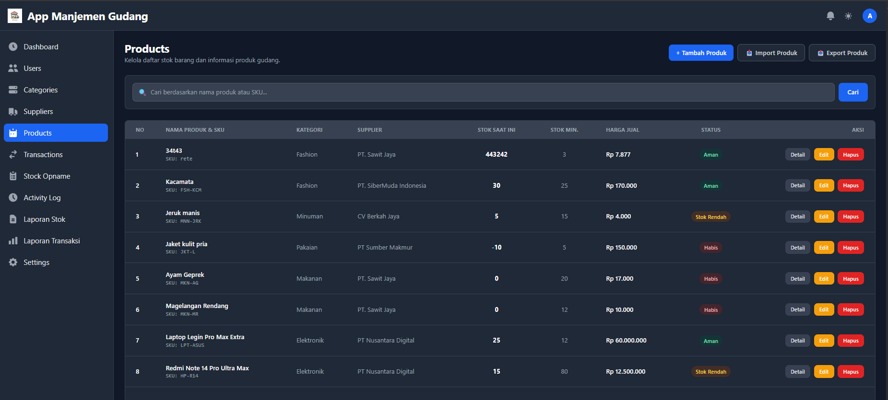
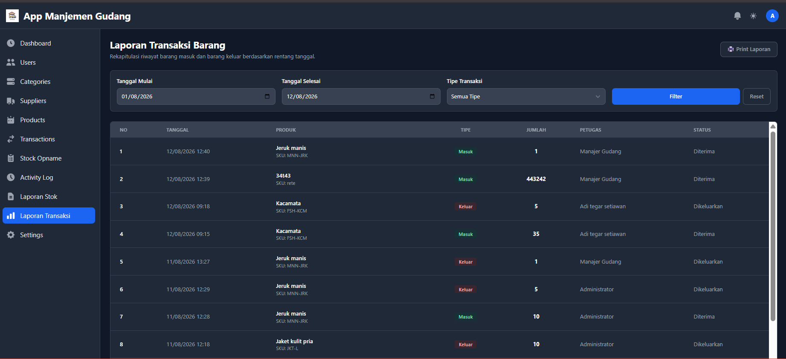

# 📦 Stockify - Inventory & Warehouse Management System

**Stockify** adalah aplikasi manajemen stok barang dan transaksi gudang berbasis web yang dibangun menggunakan **Laravel**. Aplikasi ini dirancang untuk memudahkan pengelolaan stok barang, pemantauan transaksi masuk/keluar, serta pelaksanaan *stock opname* secara terintegrasi dan akurat.

---

## 🚀 Fitur Utama

- 🔐 **Authentication & Multi-Role Access Control:**
  - **Admin:** Memiliki akses penuh ke seluruh fitur sistem, termasuk manajemen pengguna, supplier, kategori, serta opsi import/export data.
  - **Manajer Gudang:** Mengelola data produk, mencatat transaksi barang masuk/keluar, dan melakukan *stock opname*.
  - **Staff Gudang:** Melihat stok, melakukan konfirmasi status transaksi barang, dan pencatatan operasional harian.
- 📦 **Manajemen Produk & Stok:**
  - Pencatatan SKU, harga jual, stok fisik, serta ambang batas stok minimum (*minimum stock alert*).
  - Tampilan ber-tabel interaktif dengan *internal scrolling* dan indikator status stok (Aman, Stok Rendah, Habis).
- 🏷️ **Manajemen Kategori & Supplier:**
  - Pengelompokan barang dan pendataan vendor/pemasok lengkap dengan fitur pencarian interaktif.
- 🔄 **Transaksi Stok (Stock Transactions):**
  - Pencatatan transaksi Barang Masuk & Barang Keluar lengkap dengan status persetujuan (*Pending, Diterima, Dikeluarkan, Ditolak*).
- 📋 **Stock Opname:**
  - Pemeriksaan berkala antara stok fisik di lapangan dengan stok sistem, lengkap dengan perhitungan selisih otomatis.
- 📥 **Import & Export Data:**
  - Fitur import dan export data produk dalam format Excel/CSV.
- 📜 **Activity Logs:**
  - Pencatatan riwayat aktivitas pengguna (*audit trail*) untuk setiap perubahan data penting.

---

## 🖼️ Tampilan Aplikasi

<p align="center">
  
  <br>
  <em>Tampilan Dashboard Utama & Activity Log</em>
</p>

<br>

<p align="center">
  
  <br>
  <em>Tampilan Dashboard Utama & Activity Log</em>
</p>

<br>

<p align="center">
  
  <br>
  <em>Tampilan untuk fitur product</em>
</p>

<br>

<p align="center">
  
  <br>
  <em>Tampilan fitur untuk laporan</em>
</p>

## 🛠️ Teknologi & Arsitektur

- **Framework:** [Laravel 10.x / 11.x](https://laravel.com)
- **Language:** PHP 8.x
- **Database:** MySQL
- **Styling & UI:** Tailwind CSS & Flowbite Components
- **Architecture Pattern:** **Repository Pattern & Service Layer** (Memisahkan bisnis logika, query database, dan layer controller secara bersih dan terstruktur).

---

## ⚙️ Panduan Instalasi (Installation Guide)

Ikuti langkah-langkah di bawah ini untuk menjalankan proyek ini di lingkungan lokal Anda:

### 1. Prasyarat (*Prerequisites*)
- PHP >= 8.1
- Composer
- Node.js & NPM
- MySQL Database

### 2. Kloning Repositori
```bash
git clone [https://github.com/username/stockify.git](https://github.com/username/stockify.git)
cd stockify
